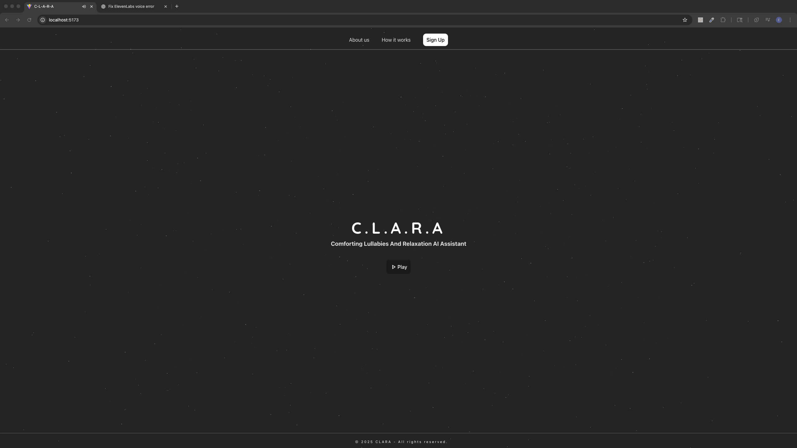
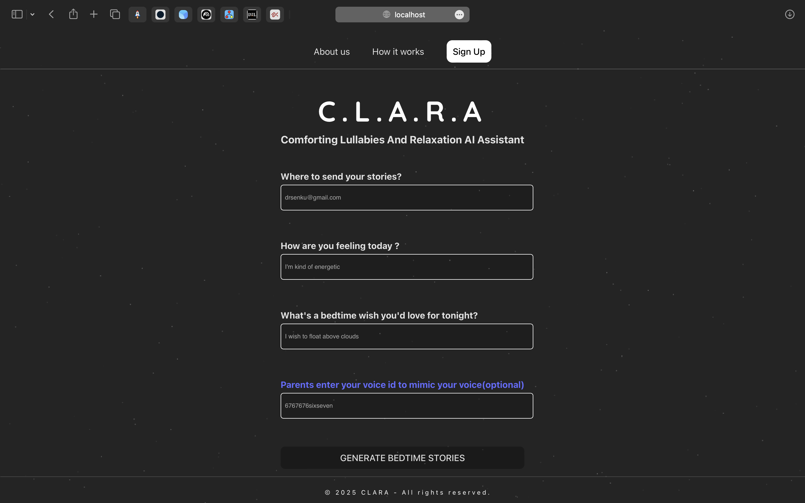
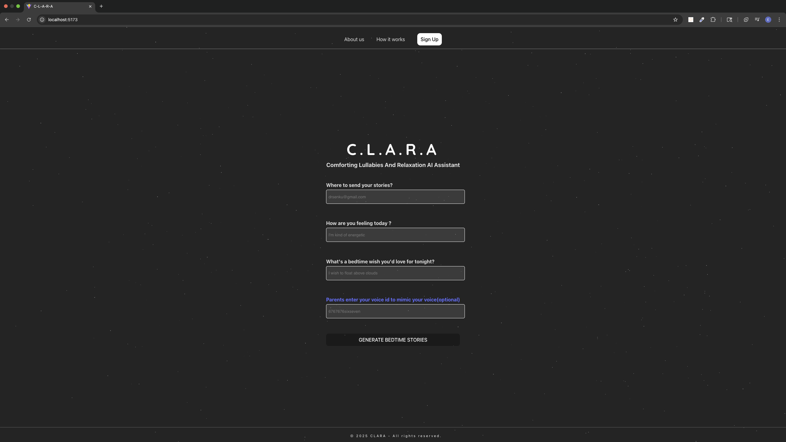

<h2 align="center"> CLARA — Comforting Lullabies And Relaxation AI Assistant </h2>

CLARA is an emotionally intelligent bedtime assistant that delivers personalized stories using AI and voice synthesis. Designed for both children and adults, it uses real-time mood and bedtime wish input to craft thoughtful bedtime narratives spoken aloud through lifelike voices generated by ElevenLabs.

Whether it's a child hearing a story in a parent's voice or an adult managing insomnia with a calm narrative, CLARA is more than a tool — it's a bedtime ritual built with care.

## 💡 Wish me luck working as a solo

## Features

<li> Takes user mood and bedtime wish to generate fully personalized stories </li>
<li> Uses Google Gemini to create emotionally aware responses in natural language </li>
<li> Converts story to audio using ElevenLabs text-to-speech engine </li>
<li> Supports “parent voice mode” with speech fillers and a more human tone </li>
<li> Gathers user mood, bedtime wish, and email to craft deeply personalized bedtime stories </li>
<li> Uses Google Gemini to generate calm, emotionally intelligent narratives tailored to user input </li>
<li> Converts generated stories into natural-sounding audio using ElevenLabs’ voice synthesis API </li>
<li> Offers optional “Parent Voice Mode” that adds warmth, fillers, and a human storytelling tone </li>
<li> Emails the generated stories directly to the user for future playback and comfort </li>
<li> Includes playback controls, loading animations, and “Generate Another” options for seamless interaction </li>

## Extra Features

<li> Rating stories to have a global rankings for others to access</li>
<li> Future plans: Image cover generation and emailed stories </li>

## Tech Stack

<li> Node.js </li>
<li> Express </li>
<li> ElevenLabs API </li>
<li> Google Gemini API </li>
<li> HTML / CSS / JavaScript (Frontend MVP) </li>

## 💡 Why CLARA?

<li> Helps children fall asleep to the sound of a familiar voice — even when parents are away </li>
<li> Supports adults with anxiety, insomnia, or racing thoughts through calm storytelling </li>
<li> Encourages consistent bedtime routines backed by gentle, emotionally intelligent design </li>
<li> Voice options make it accessible, comforting, and easy to personalize </li>

## Screenshots

  

